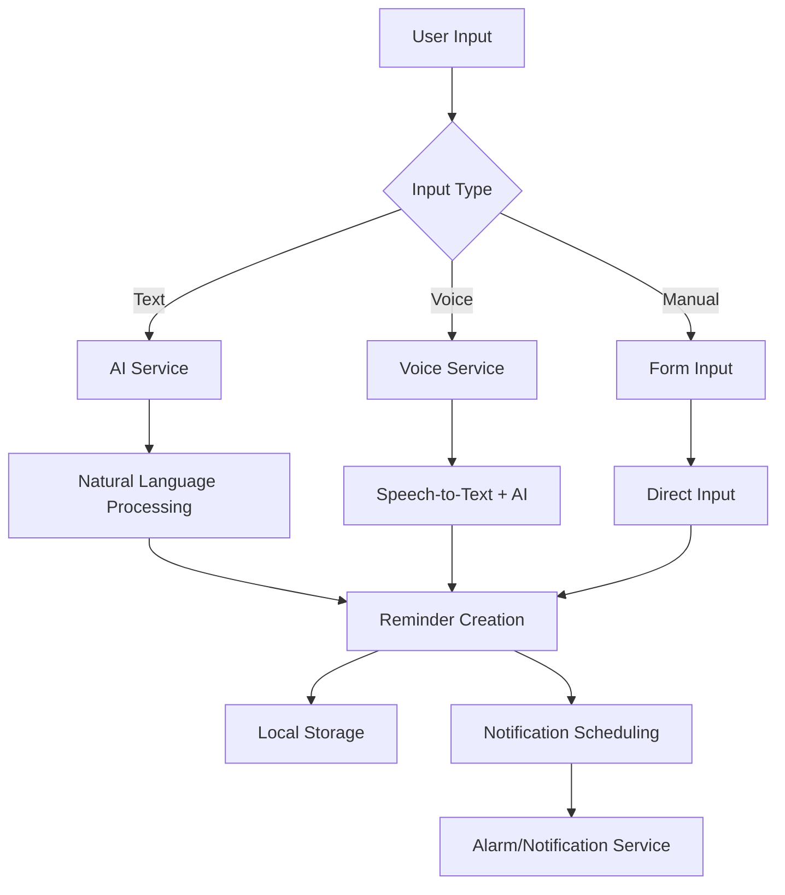

   
   

   
   
   

# VoiceRemind - Voice-First Reminder App

**Status: Early Access - Working with Voice and AI Features**

Create reminders using your voice or AI-powered text generation. Speak naturally or type casually and let AI understand what you want to remember.

## What VoiceRemind Does

**AI Text:** Type "Remind me to call mom tomorrow at 3pm and buy groceries tonight"
**VoiceRemind:** Creates two separate reminders with correct dates and times

**Voice Input:** Say "Meeting with John next Tuesday at 3 PM"
**VoiceRemind:** Understands your speech and creates a properly scheduled reminder

**Multi-Time Reminders:** "Take medication 3 times daily at 8am, 2pm, and 8pm"
**VoiceRemind:** Creates a single reminder with three time slots you can track individually

The app works by using AI to understand natural language and create smart reminders from your speech or text.

## Current Status

**Working Right Now:**
- AI-powered reminder generation from text (Gemini and Groq support)
- Voice recording with advanced speech-to-text (Groq Whisper API + device native)
- Image-based reminder extraction (Gemini only)
- Multi-time reminders (multiple time slots per day with individual tracking)
- Custom repeat patterns (specific days of week, intervals)
- Create, edit, delete, and snooze reminders
- Smart notifications and alarm system
- Calendar view with Day/Week/Month custom views
- Organize reminders into Spaces
- Search and filter reminders
- Theme support (Nothing-inspired light/dark themes)
- Auto-update checking
- Boot reschedule for persistent reminders
- Full Android support
- Basic iPhone support
- Web browser support

**Still Being Improved:**
- Cloud sync across devices (currently local-first only)
- Location-based reminders
- Advanced AI scheduling suggestions

## Installation

### Android (Primary Platform - Fully Supported)
1. Download the APK file from our GitHub releases
2. Enable "Install from unknown sources" in Android Settings > Security
3. Install the APK file
4. Grant microphone permissions when prompted
5. Open VoiceRemind and start creating reminders

### iPhone/iPad (Basic Support)
Currently requires building from source code. Basic functionality works but some features may have limitations.

### Web Browser (Recommended Alternative)
Visit our GitHub Pages site - works well on desktop and mobile browsers (Chrome, Firefox, Safari, Edge)

### Desktop Platforms (Limited Support)

**Windows & macOS:** Available but currently have known issues due to limited testing. We recommend using the web version on desktop until these are resolved.

**Issues may include:**
- Notification problems
- Voice recognition reliability
- Performance issues
- UI scaling problems

If you want to try desktop versions anyway, download from GitHub releases but expect some problems.

## Setting Up AI Features

VoiceRemind needs an AI provider for voice recognition and smart text processing. Choose one:

### Option 1: Google Gemini (Recommended for Voice)
1. Go to **https://aistudio.google.com/apikey/**
2. Click "Get API key in Google AI Studio"
3. Sign in with your Google account
4. Create a new project or select existing one
5. Click "Create API key"
6. Copy the key (starts with "AIza...")

**Free limits:** 15 requests per minute, 1500 requests per day

### Option 2: Groq (Fastest for Text)
1. Go to **https://console.groq.com/keys/**
2. Sign up for a free account
3. Navigate to "API Keys" section
4. Create new API key
5. Copy the key (starts with "gsk_...")

**Free limits:** 14,400 requests per day (very generous)

### Configure in VoiceRemind
1. Open VoiceRemind
2. Tap the Settings icon (gear icon in top right)
3. Select "AI Provider Configuration"
4. Choose your provider (Gemini or Groq)
5. Paste your API key
6. Tap "Save"

**Success indicator:** You'll see a green "AI Ready" status when configured correctly.

## How to Use

### Creating Reminders with AI Text

1. Tap the "+" button
2. Select "AI" tab
3. Type naturally: "Doctor appointment next Friday at 2:30 PM"
4. Tap "Generate Reminders"
5. Review the suggested reminders
6. Select which ones to create
7. Tap "Create Selected Reminders"

**Examples that work well:**
- "Meeting with Sarah tomorrow at 10am"
- "Buy groceries tonight and walk the dog at 6pm"
- "Call dentist next week and pay rent by Friday"
- "Take medicine every morning at 8am"

### Creating Reminders with Voice

1. Tap the "+" button
2. Select "Voice" tab
3. Tap "Start Recording"
4. Speak clearly: "Remind me to submit the report by Thursday afternoon"
5. Tap "Stop Recording"
6. Review the generated reminders
7. Select and create the ones you want

**Voice tips:**
- Speak clearly and at normal pace
- Include specific times when possible
- Mention dates relative to today ("tomorrow", "next Monday")
- You can create multiple reminders in one sentence

### Manual Reminder Creation

1. Tap the "+" button
2. Select "Manual" tab
3. Enter title and description
4. Set date and time
5. Choose repeat options (daily, weekly, monthly)
6. Tap "Create Reminder"

### Managing Your Reminders

**View All Reminders:**
- Home screen shows upcoming reminders
- Completed reminders appear in "Done" section
- Overdue reminders are highlighted in red

**Mark Complete:**
- Tap the checkbox next to any reminder
- Completed reminders move to bottom section

**Edit or Delete:**
- Tap any reminder to open details
- Use edit button to modify
- Use delete button to remove permanently

**Search and Filter:**
- Tap search icon to find specific reminders
- Use filter button to sort by date, status, or space
- Filter by completion status or urgency

### Organizing with Spaces

**Create Spaces:**
1. Go to Settings
2. Tap "Manage Spaces"  
3. Add spaces like "Work", "Personal", "Health", "Shopping"
4. Assign reminders to spaces when creating them

**Use Spaces:**
- Select space from dropdown on home screen
- Filter reminders by workspace
- Organize different life areas separately

## Notifications

VoiceRemind sends smart notifications:

**Android (Fully Supported):**
- Sound and vibration alerts
- Persistent notifications for important items
- Notification badges on app icon
- Quick actions from notification panel

**Web Browser (Recommended for Desktop):**
- Browser notifications (allow when prompted)
- Works even when tab is closed
- Sound alerts in supported browsers
- Cross-platform compatibility

**iPhone/iPad (Basic Support):**
- Standard iOS notifications
- May have some limitations compared to Android

**Desktop Apps (Known Issues):**
- Windows/macOS notification systems may not work reliably
- We recommend using the web version for consistent notifications

## Troubleshooting

### AI Features Not Working

**"AI Provider Not Configured" message:**
1. Go to Settings > AI Provider Configuration
2. Make sure you selected a provider (Gemini or Groq)
3. Verify your API key is entered correctly
4. Check your internet connection

**"Invalid API Key" error:**
1. Double-check you copied the full API key
2. Make sure key is from the correct provider
3. Try generating a new API key
4. Verify your account has remaining credits

**Poor AI results:**
1. Be more specific with dates and times
2. Use clear, simple language
3. Try breaking complex requests into smaller parts
4. Switch between Gemini and Groq to see which works better

### Voice Recognition Problems

**Voice not recognized:**
1. Check microphone permissions in device settings
2. Speak clearly and at normal pace
3. Ensure good microphone quality
4. Try in a quiet environment

**Wrong transcription:**
1. Speak more slowly and clearly
2. Use common words when possible
3. Repeat numbers clearly ("three P M" instead of "3pm")
4. Try the AI text tab as backup

### General App Issues

**No notifications appearing:**
1. Check device notification settings
2. Make sure VoiceRemind has notification permissions
3. Test with a reminder set for 1 minute from now
4. Restart the app and try again
5. **Desktop users:** Try the web version instead

**App crashes or won't start:**
1. Restart your device
2. Reinstall the app
3. Make sure you have enough storage space
4. Check that your device meets minimum requirements
5. **Desktop users:** Use web browser version as alternative

**Performance slow:**
1. Close other apps running in background
2. Clear app data (will lose local reminders)
3. Check your internet connection for AI features
4. Try reducing number of active reminders
5. **Desktop users:** Switch to web browser version

### Platform-Specific Issues

**Windows/macOS Desktop:**
- If experiencing crashes, UI problems, or notification issues
- Switch to web browser version for better reliability
- Desktop versions need more testing and may have bugs

**iPhone/iPad:**
- Limited testing on iOS devices
- Some features may not work perfectly
- Web browser version recommended as backup

## Privacy and Your Data

**Local Storage:**
- All reminders stored on your device
- No account required to use basic features
- Works completely offline (except AI features)

**AI Processing:**
- Text/voice you input is sent to your chosen AI provider
- No other personal data is shared
- You control which AI provider to use
- Audio recordings stay on your device

**API Keys:**
- Stored only on your device
- Never shared with VoiceRemind developers
- You pay for your own AI usage (free tiers available)
- Can be deleted anytime in settings

## Costs and Limits

**VoiceRemind App:** Completely free

**AI Usage:**
- **Gemini:** 15 requests/minute, 1500/day (free)
- **Groq:** 14,400 requests/day (free)
- Both providers have generous free tiers
- Check provider websites for current limits

**Typical Usage:**
- Creating 20-30 reminders per day stays within free limits
- Voice recognition uses 1 request per recording
- Text generation uses 1 request per generation

## Getting Help

**Common Questions:**
- Works completely offline for basic reminders
- Voice features require internet for processing
- No ads, subscriptions, or hidden costs
- Your data never leaves your device (except AI processing)

**Report Problems:**
1. Note what you were doing when problem occurred
2. Include your device type and operating system
3. Mention whether you were using AI features
4. Submit issue on our GitHub repository

**Feature Requests:**
- Submit suggestions on GitHub
- Join community discussions
- Help test new features

## System Requirements

**Android:** Version 5.0 (API 21) or higher *(Fully Supported)*  
**Web Browser:** Chrome 88+, Firefox 85+, Safari 14+, Edge 88+ *(Recommended for Desktop)*  
**iPhone/iPad:** iOS 11.0 or higher *(Basic Support)*  
**Windows:** Windows 10 or higher *(Limited Support - Known Issues)*  
**macOS:** macOS 10.14 or higher *(Limited Support - Known Issues)*

**For Voice Features:**
- Microphone access
- Internet connection for AI processing
- Clear audio environment recommended

**Recommended Setup:**
- **Mobile:** Android device with VoiceRemind APK
- **Desktop:** Use web browser version for best experience

## What's Coming Next

**Short Term:**
- Enhanced voice processing accuracy
- Better offline capabilities
- More natural language understanding

**Medium Term:**
- Cloud sync across devices
- Calendar integration
- Voice output (app speaks reminders)

**Long Term:**
- Apple Watch support
- Smart home integration
- Advanced AI scheduling

---

**Note:** This is early access software. While core features work reliably, some advanced features are still being improved. Keep important reminders backed up elsewhere if needed.