# VoiceRemind - Technical Project Plan & Developer Documentation

**Version:** 1.0  
**Last Updated:** January 2025  
**Project Type:** Cross-Platform Mobile Application  
**Target Market:** Memory-impaired users, ADHD community, accessibility-focused users

---

## Table of Contents

1. [Project Overview](#project-overview)
2. [Business Requirements](#business-requirements)
3. [Technical Architecture](#technical-architecture)
4. [Development Strategy](#development-strategy)
5. [Implementation Phases](#implementation-phases)
6. [Team Structure](#team-structure)
7. [Technology Stack](#technology-stack)
8. [Quality Assurance](#quality-assurance)
9. [Deployment Strategy](#deployment-strategy)
10. [Risk Assessment](#risk-assessment)
11. [Success Metrics](#success-metrics)
12. [Timeline & Milestones](#timeline--milestones)

---

## Project Overview

### Vision Statement
Create the most intuitive voice-first reminder application that serves users with memory challenges, ADHD, and those requiring hands-free interaction.

### Core Value Proposition
- **Voice-First Design**: Optimized for spoken input while mobile/walking
- **Memory-Focused UX**: Designed specifically for users with memory impairments
- **Beautiful Interface**: Clean, accessible UI that current apps lack
- **Offline-First**: Functions without internet connectivity
- **Persistent Notifications**: Smart reminder system that doesn't give up

### Target Users
- **Primary**: Adults with ADHD (32% of global population uses voice assistants weekly)
- **Secondary**: Memory-impaired individuals, elderly users
- **Tertiary**: Busy professionals seeking hands-free productivity

### Competitive Advantages
1. **Specialized UX** for memory-challenged users
2. **Superior voice processing** with offline capabilities
3. **Persistent notification system** designed for forgetful users
4. **Beautiful, accessible interface** addressing current market gaps
5. **Extensible architecture** for future AI-powered features

---

## Business Requirements

### Functional Requirements

#### Core Features (MVP)
- **FR-001**: Voice-to-text reminder creation via natural speech
- **FR-002**: AI-powered date/time extraction from speech
- **FR-003**: Local storage with offline functionality
- **FR-004**: Smart notification system with customizable persistence
- **FR-005**: Text-to-speech reminder playback
- **FR-006**: Cloud synchronization across devices
- **FR-007**: Cross-platform compatibility (iOS, Android)

#### Advanced Features (Post-MVP)
- **FR-008**: Natural language processing for complex scheduling
- **FR-009**: Location-based reminders
- **FR-010**: Integration with external calendars
- **FR-011**: Voice-controlled reminder management
- **FR-012**: AI-powered reminder suggestions
- **FR-013**: Team/family reminder sharing

### Non-Functional Requirements

#### Performance
- **NFR-001**: Voice recognition latency < 2 seconds
- **NFR-002**: App launch time < 3 seconds
- **NFR-003**: Offline functionality for all core features
- **NFR-004**: Support for 50+ concurrent local reminders

#### Accessibility
- **NFR-005**: WCAG 2.1 AA compliance
- **NFR-006**: High contrast mode support
- **NFR-007**: Screen reader compatibility
- **NFR-008**: Voice-only navigation capability

#### Reliability
- **NFR-009**: 99.5% uptime for cloud services
- **NFR-010**: Data backup and recovery mechanisms
- **NFR-011**: Offline-first architecture with sync conflict resolution

#### Security
- **NFR-012**: End-to-end encryption for cloud data
- **NFR-013**: Local data encryption
- **NFR-014**: GDPR compliance for EU users

---

## Technical Architecture

### System Architecture Overview

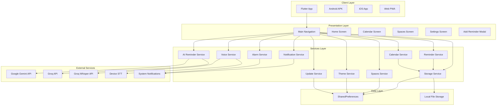

### Architecture Layers Explained

**Presentation Layer:**
- Material 3 design with Nothing-inspired themes
- Bottom navigation with floating nav bar
- Modal bottom sheets for add reminder
- Calendar views (Day/Week/Month custom implementations)

**Services Layer:**
- AI Reminder Service: Natural language processing (Gemini/Groq)
- Voice Service: Speech recognition and audio recording
- Reminder Service: CRUD operations with validation
- Notification/Alarm Service: Smart scheduling
- Storage Service: Local data persistence
- Calendar Service: Event management
- Theme Service: Light/dark mode management
- Update Service: Auto-update checking

**Data Layer:**
- SharedPreferences for app settings and reminders
- Local file storage for voice recordings (temporary)
- No cloud storage (local-first architecture)

### Data Architecture

#### Local Data Model

```dart
// Core reminder model with multi-time and custom repeat support
class Reminder {
  String id;                          // UUID
  String title;                       // Required
  String? description;                // Optional
  DateTime scheduledTime;             // Primary scheduled time
  ReminderStatus status;              // pending, completed, overdue
  RepeatType repeatType;              // none, daily, weekly, monthly, custom
  DateTime createdAt;                 // Creation timestamp
  DateTime updatedAt;                 // Last update timestamp
  bool isNotificationEnabled;         // Notification toggle
  String? spaceId;                    // Organization space
  List<TimeSlot> timeSlots;          // Multi-time support
  bool isMultiTime;                   // Multi-time flag
  CustomRepeatConfig? customRepeatConfig; // Custom repeat patterns
  DateTime? snoozedUntil;            // Snooze functionality
}

// Time slot for multi-time reminders
class TimeSlot {
  String id;                          // UUID
  TimeOfDay time;                     // Specific time
  String? description;                // Optional description
  ReminderStatus status;              // Individual status
  DateTime? completedAt;              // Completion timestamp
}

// Custom repeat configuration
class CustomRepeatConfig {
  int minutes;                        // Minute interval
  int hours;                          // Hour interval
  int days;                           // Day interval
  Set<int>? specificDays;            // Days of week (1=Mon, 7=Sun)
  DateTime? endDate;                  // Optional end date
}

// Space model for organization
class Space {
  String id;                          // UUID
  String name;                        // Display name
  IconData icon;                      // Icon
  Color color;                        // Color code
  int reminderCount;                  // Cached count
  DateTime createdAt;                 // Creation timestamp
}
```

#### Data Storage Strategy

**Local-First Architecture:**
- All data stored in SharedPreferences (JSON serialization)
- No cloud sync currently implemented
- Reminders, spaces, settings all local
- Voice recordings stored temporarily in app cache

**Data Persistence Flow:**
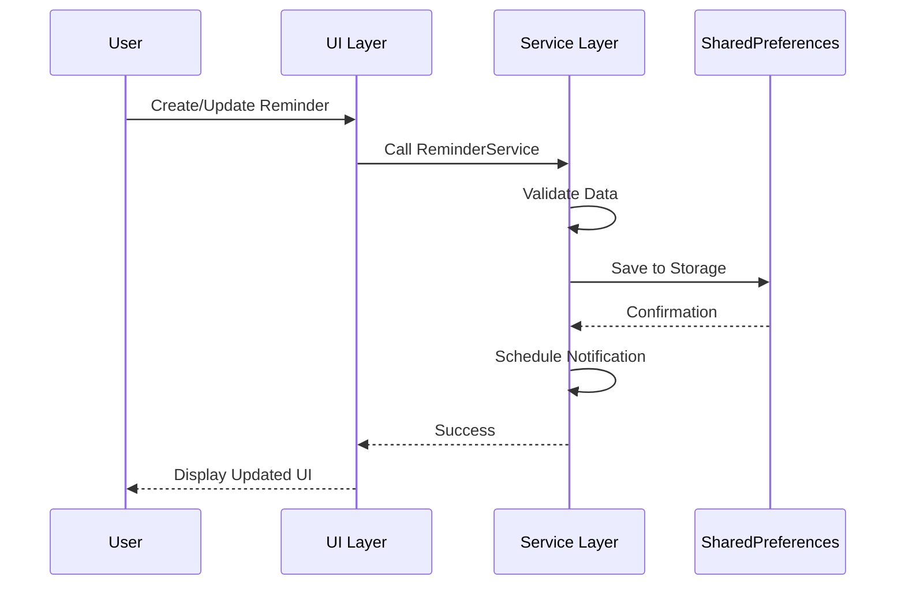

### AI & Voice Processing Architecture

#### Reminder Creation Flow

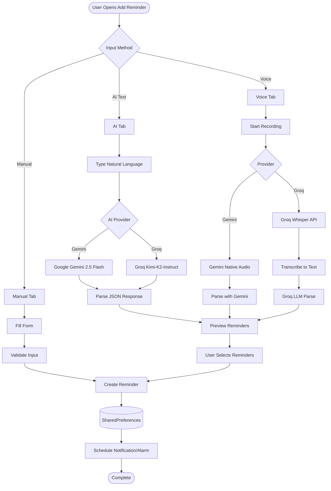

#### Voice Processing Detailed Flow

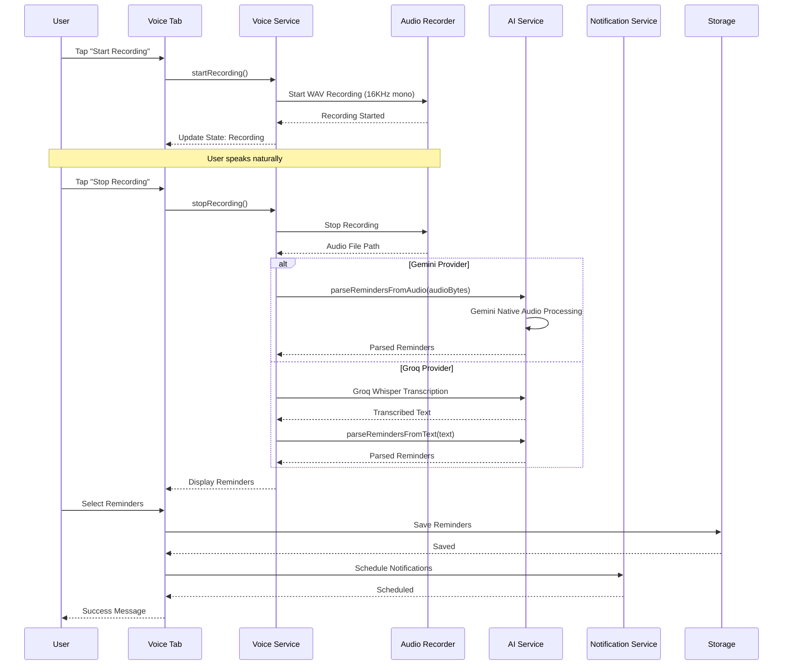

#### AI Parsing Process

```mermaid
flowchart LR
    Input[User Input Text/Voice] --> Context[Add Time Context]
    Context --> Prompt[Build System Prompt]
    Prompt --> API{AI Provider}

    API -->|Gemini| G1[Gemini 2.5 Flash]
    API -->|Groq| G2[Kimi-K2-Instruct]

    G1 --> Schema[Enforce JSON Schema]
    G2 --> Schema

    Schema --> Parse[Parse Response]
    Parse --> Extract[Extract Reminders]

    Extract --> MultiTime{Multi-Time?}
    MultiTime -->|Yes| Slots[Create Time Slots]
    MultiTime -->|No| Single[Single Time]

    Slots --> Repeat{Custom Repeat?}
    Single --> Repeat

    Repeat -->|Yes| Config[Custom Repeat Config]
    Repeat -->|No| Standard[Standard Repeat]

    Config --> Output[Reminder Objects]
    Standard --> Output
    Output --> Return([Return to UI])
```

### Security Architecture

#### Data Protection
- **Local Storage**: JSON serialization in SharedPreferences (no encryption currently)
- **API Keys**: Stored in SharedPreferences (user-provided)
- **Transit**: HTTPS for all AI API calls
- **Voice Data**: Temporary files deleted after processing

#### Privacy Design
- **Voice Data**: Processed locally or via API, never permanently stored
- **No Cloud Sync**: All data remains on device
- **API Keys**: User-controlled, never transmitted to VoiceRemind servers
- **No Analytics**: No usage tracking or telemetry

---

## Development Strategy

### Development Methodology
**Agile Scrum** with 2-week sprints
- Daily standups (async for distributed teams)
- Sprint planning and retrospectives
- Continuous integration and delivery

### Code Quality Standards
- **Test Coverage**: Minimum 80% for core features
- **Code Review**: All PRs require approval from senior developer
- **Static Analysis**: Flutter lint rules + custom analysis
- **Documentation**: Comprehensive inline and API documentation

### Version Control Strategy
```
main (production)
├── develop (integration)
├── feature/voice-recognition
├── feature/reminder-crud
├── feature/notification-system
└── hotfix/critical-bug-fix
```

### Environment Strategy
- **Development**: Local development with Firebase emulators
- **Staging**: Firebase staging project with test data
- **Production**: Firebase production with monitoring

---

## Implementation Phases

### Phase 1: Foundation (Weeks 1-4)
**Objective**: Core voice reminder functionality

#### Week 1-2: Project Setup
- [ ] Flutter project initialization with proper architecture
- [ ] Firebase project setup (Auth, Firestore, FCM)
- [ ] CI/CD pipeline configuration (GitHub Actions)
- [ ] Basic UI framework with Material 3 design
- [ ] Core navigation and state management setup

#### Week 3-4: Voice Core
- [ ] Speech-to-text integration with offline fallback
- [ ] Text-to-speech implementation
- [ ] Basic natural language processing for time/date extraction
- [ ] Voice recording and playback functionality
- [ ] Permission handling (microphone, notifications)

**Deliverables**: 
- Working voice input/output
- Basic reminder creation via voice
- Local storage of reminders

### Phase 2: Core Features (Weeks 5-8)
**Objective**: Complete reminder management system

#### Week 5-6: Reminder System
- [ ] Reminder CRUD operations with local database
- [ ] Advanced time/date parsing (natural language)
- [ ] Recurring reminder support
- [ ] Reminder editing and deletion
- [ ] Voice-based reminder management

#### Week 7-8: Notification System
- [ ] Local notification scheduling
- [ ] Persistent notification strategy for ADHD users
- [ ] Custom notification sounds and vibration patterns
- [ ] Smart notification timing based on user behavior
- [ ] Notification history and interaction tracking

**Deliverables**:
- Complete offline reminder system
- Intelligent notification system
- Voice-controlled reminder management

### Phase 3: Cloud & Sync (Weeks 9-10)
**Objective**: Multi-device synchronization

#### Week 9: Cloud Integration
- [ ] Firebase Firestore integration
- [ ] User authentication system
- [ ] Data synchronization logic with conflict resolution
- [ ] Offline-first architecture implementation

#### Week 10: Advanced Sync
- [ ] Cross-device reminder sync
- [ ] Voice recording cloud backup (optional)
- [ ] Data migration and backup systems
- [ ] Sync conflict UI and resolution

**Deliverables**:
- Multi-device synchronization
- Cloud backup and restore
- Seamless offline/online transitions

### Phase 4: Polish & Launch (Weeks 11-12)
**Objective**: Production-ready application

#### Week 11: UX Polish
- [ ] Accessibility improvements (screen readers, high contrast)
- [ ] Advanced animations and micro-interactions
- [ ] Onboarding flow for new users
- [ ] Settings and customization options
- [ ] Performance optimization

#### Week 12: Launch Preparation
- [ ] App Store submission materials
- [ ] Beta testing with target user groups
- [ ] Analytics and crash reporting integration
- [ ] Final security audit and testing
- [ ] Production deployment

**Deliverables**:
- Production-ready application
- App Store/Google Play submissions
- Beta testing program launch

---

## Team Structure

### Solo Developer Path (12 weeks)
**Full-stack development approach**
- **Weeks 1-4**: Foundation + Voice Core (40 hours/week)
- **Weeks 5-8**: Reminder System + Notifications (40 hours/week)
- **Weeks 9-10**: Cloud Integration (40 hours/week)
- **Weeks 11-12**: Polish + Launch (40 hours/week)

### 4-Developer Team Path (8 weeks)
**Parallel development approach**

#### Team Composition
1. **Lead Developer (Flutter/Dart)**
   - Architecture decisions and code reviews
   - Voice processing and core logic
   - Team coordination and technical leadership

2. **Frontend Developer (UI/UX Focus)**
   - Interface design and implementation
   - Accessibility features and animations
   - User experience optimization

3. **Backend Developer (Cloud/Sync)**
   - Firebase integration and cloud functions
   - Data synchronization logic
   - Security and performance optimization

4. **QA/DevOps Engineer**
   - Test automation and quality assurance
   - CI/CD pipeline management
   - Deployment and monitoring setup

#### Parallel Development Timeline
**Weeks 1-2**: Foundation
- Lead: Project setup + architecture
- Frontend: UI framework + design system
- Backend: Firebase setup + data models
- QA: Testing framework + CI setup

**Weeks 3-4**: Core Development
- Lead: Voice processing integration
- Frontend: Reminder UI + interactions
- Backend: Sync logic + cloud functions
- QA: Automated testing + manual testing

**Weeks 5-6**: Integration
- Lead: Voice-reminder integration
- Frontend: Notification UI + settings
- Backend: User management + security
- QA: Integration testing + performance

**Weeks 7-8**: Launch
- Lead: Code review + optimization
- Frontend: Accessibility + polish
- Backend: Production deployment
- QA: Final testing + app store prep

---

### Notification & Alarm Scheduling

#### Scheduling Flow

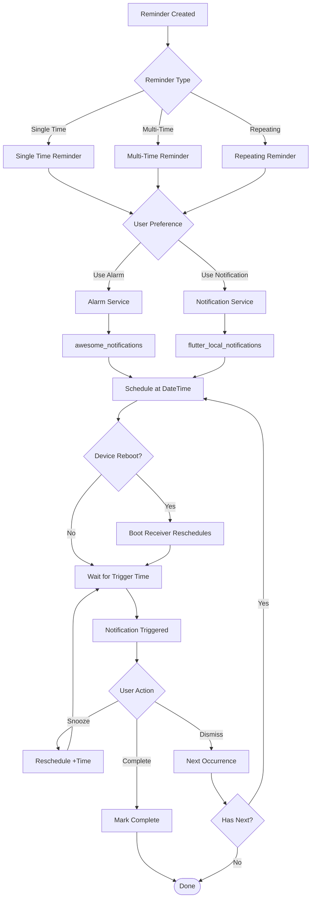

#### Multi-Time Reminder Scheduling

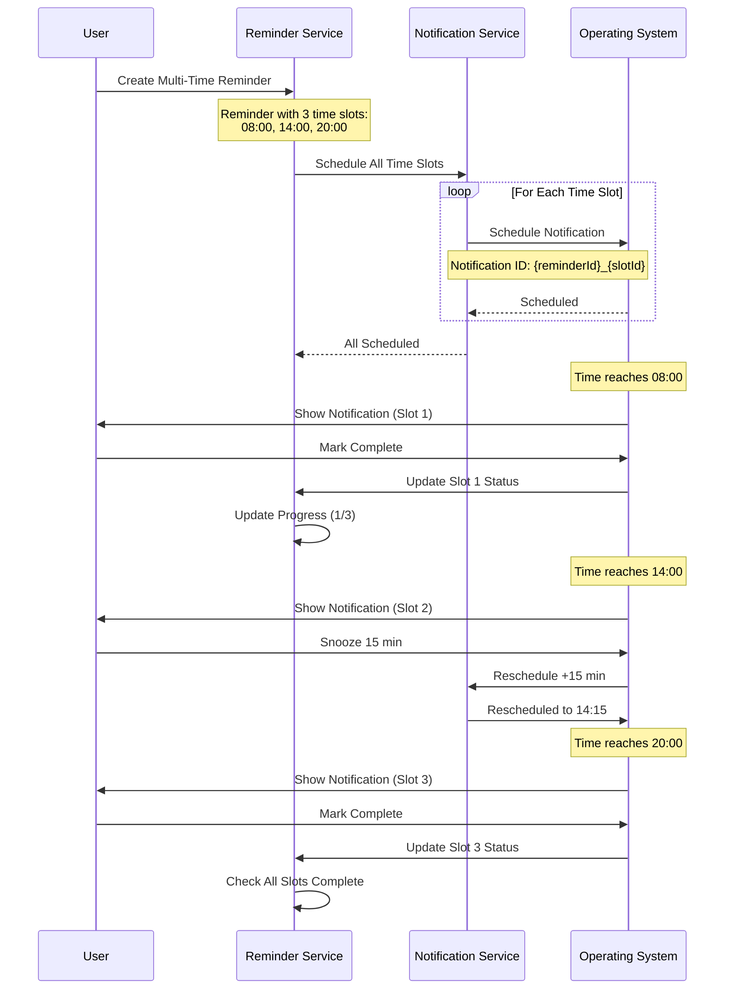

#### Boot Reschedule Flow

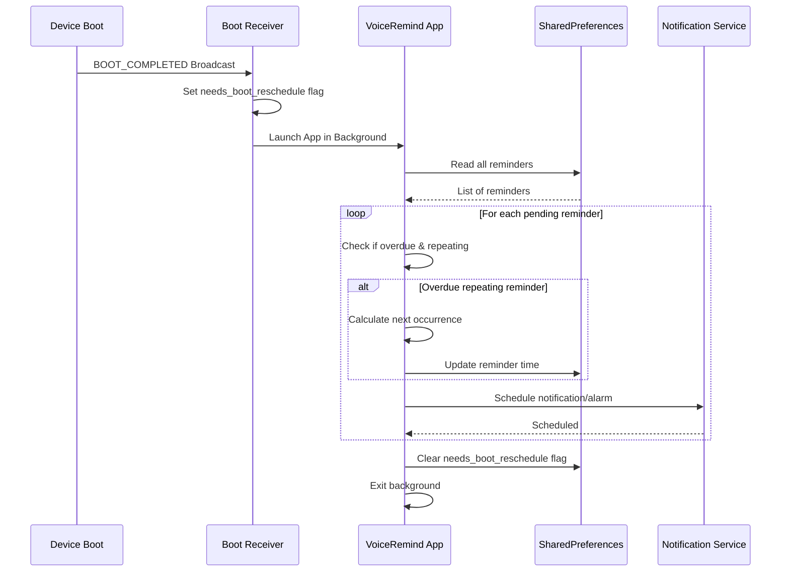

---

## Technology Stack

### Frontend Framework
```yaml
# Core Framework
flutter: 3.5.0+
dart: 3.5.0+

# UI Components
cupertino_icons: ^1.0.8
dynamic_color: ^1.7.0
flutter_slidable: ^4.0.0
```

### Voice & Speech Processing
```yaml
# Speech Recognition
speech_to_text: ^7.2.0         # Device native STT
record: ^6.0.0                 # Audio recording (16KHz WAV)

# No TTS currently implemented
```

### Data & Storage
```yaml
# Local Storage (No Hive/ObjectBox)
shared_preferences: ^2.3.3     # Primary storage for all data
path_provider: ^2.1.5          # Temp file paths for voice recordings

# No Cloud Database
# No Firebase (local-first architecture)
```

### AI & Natural Language Processing
```yaml
# AI Providers
google_generative_ai: ^0.4.6   # Gemini 2.5 Flash
http: ^1.1.0                   # Groq API calls

# Image Processing
image_picker: ^1.0.7           # Image-based reminders (Gemini only)
```

### Notifications & Alarms
```yaml
flutter_local_notifications: ^19.4.0  # Standard notifications
awesome_notifications: ^0.10.0+1      # Alarm system
timezone: ^0.10.1                      # Timezone support
alarm: ^5.1.4                          # Alarm package
flutter_ringtone_player: ^4.0.0        # Sound playback
flutter_fgbg: ^0.7.1                   # Foreground/background detection
```

### Calendar
```yaml
kalender: ^0.11.0              # Calendar package (custom views implemented)
```

### Utilities
```yaml
uuid: ^4.5.1                   # UUID generation
intl: ^0.20.2                  # Date formatting
flutter_dotenv: ^5.1.0         # Environment variables
permission_handler: ^12.0.1    # Runtime permissions
device_info_plus: ^11.5.0      # Device information
package_info_plus: ^8.3.0      # App version info
url_launcher: ^6.2.4           # External links
open_filex: ^4.7.0             # File opening
```

### Development & Testing
```yaml
# Testing
flutter_test: sdk
# No unit tests currently implemented

# Code Quality
flutter_lints: ^6.0.0
```

---

## Quality Assurance

### Testing Strategy

#### Unit Tests (Target: 90% coverage)
- **Voice Processing**: STT accuracy, TTS functionality
- **Reminder Logic**: CRUD operations, scheduling algorithms
- **Sync Logic**: Conflict resolution, data consistency
- **Notification System**: Scheduling, persistence logic

#### Integration Tests
- **Voice-to-Reminder Flow**: End-to-end voice reminder creation
- **Sync Scenarios**: Online/offline transitions, multi-device sync
- **Notification Delivery**: Timing accuracy, user interaction handling

#### UI Tests
- **Accessibility**: Screen reader compatibility, keyboard navigation
- **Responsive Design**: Various screen sizes and orientations
- **Voice Navigation**: Complete app navigation via voice commands

#### Performance Tests
- **Voice Recognition Latency**: < 2 seconds for recognition
- **App Launch Time**: < 3 seconds cold start
- **Memory Usage**: < 200MB peak usage
- **Battery Impact**: Minimal background processing

### Code Quality Metrics
- **Test Coverage**: Minimum 80% for core features
- **Cyclomatic Complexity**: Maximum 10 per method
- **Code Duplication**: Maximum 3% duplicate code
- **Static Analysis**: Zero critical issues

### User Acceptance Testing
- **ADHD User Group**: 20 users, 2-week beta test
- **Accessibility Testing**: Users with various disabilities
- **Performance Testing**: Various device configurations
- **Usability Testing**: Task completion rates and user satisfaction

---

## Deployment Strategy

### Distribution Approach: GitHub-First Strategy

#### Primary Distribution (100% Free)

**GitHub Releases (Android)**
```yaml
Platform: GitHub Repository
Cost: $0 (completely free)
Features:
  - Direct APK download
  - Automatic releases via GitHub Actions
  - Version management with git tags
  - Release notes and changelogs
  - Global accessibility
```

**GitHub Pages (Web App)**
```yaml
Platform: GitHub Pages
Cost: $0 (completely free)
Features:
  - Progressive Web App hosting
  - Custom domain support (optional $10/year)
  - HTTPS enabled
  - CDN included
  - Unlimited bandwidth for public repos
```

#### Alternative Distribution Platforms

**Free App Stores:**
- **F-Droid**: Open source app repository
- **Amazon Appstore**: Alternative Android store
- **APKPure**: Third-party app repository
- **Samsung Galaxy Store**: Device-specific store

**Free Web Hosting Alternatives:**
- **Netlify**: 100GB bandwidth/month free
- **Vercel**: Free tier with excellent performance
- **Firebase Hosting**: 10GB storage + 1GB transfer/day
- **Cloudflare Pages**: Unlimited bandwidth on free tier

#### Premium Distribution (Optional Future Expansion)

**Google Play Store**
```yaml
Cost: $25 one-time fee
Benefits:
  - Wider discoverability
  - Automatic updates
  - User reviews and ratings
  - Google Play Protect security
When to Use: When app generates revenue to justify cost
```

**Apple App Store**
```yaml
Cost: $99/year
Benefits:
  - iOS market access
  - App Store optimization
  - Premium user base
When to Use: When iOS users represent significant opportunity
```

### Development Environments

#### Local Development (100% Free)
```yaml
Environment: Local Machine
IDE: VS Code or Android Studio (both free)
Database: Local Hive database + Firebase emulators
Authentication: Test accounts
Voice APIs: Device native (free)
Version Control: Git + GitHub (free)
```

#### Staging Environment (100% Free)
```yaml
Environment: GitHub Actions Runners
Database: Firebase staging project (free tier)
Authentication: Firebase Auth staging
Voice APIs: Device native + API development keys
Hosting: GitHub Pages staging branch
Monitoring: GitHub insights + basic analytics
```

#### Production Environment (100% Free)
```yaml
Environment: GitHub Pages + Firebase
Database: Firebase production (free tier)
Authentication: Firebase Auth production
Voice APIs: Device native + production keys
Hosting: GitHub Pages main branch
Monitoring: Firebase Analytics (free) + GitHub insights
```

### CI/CD Pipeline Strategy

#### GitHub Actions Workflow (100% Free)
```yaml
Free Tier: 2000 minutes/month
Sufficient for: Multiple daily builds and releases

Workflow Features:
  - Automated testing on every PR
  - Automated builds for Android APK
  - Automated web deployment to GitHub Pages
  - Release management with semantic versioning
  - Quality gates with linting and testing
```

#### Continuous Integration Jobs
```yaml
1. Code Quality Check:
   - Flutter analyze
   - Dart format verification
   - Dependency security audit
   - Lint compliance check

2. Automated Testing:
   - Unit test execution
   - Integration test suite
   - Test coverage reporting
   - Performance benchmarks

3. Build Verification:
   - Android APK build (release)
   - Web build compilation
   - Asset optimization
   - Size analysis reporting
```

#### Continuous Deployment Pipeline
```yaml
Development Builds:
  - Trigger: Every commit to develop branch
  - Target: GitHub Pages staging
  - Audience: Development team
  - Process: Automated deployment

Release Builds:
  - Trigger: Git tag creation (v1.0.0)
  - Target: GitHub Releases + GitHub Pages
  - Audience: Public users
  - Process: Manual approval for final release
```

### Release Strategy Options

#### Option 1: GitHub-Only Strategy (Recommended Start)
```yaml
Timeline: 0-12 months
Platforms: Android APK + Web PWA
Distribution: GitHub Releases + GitHub Pages
Marketing: ADHD communities, accessibility forums
Cost: $0 total
Benefits:
  - Zero upfront costs
  - Complete control over distribution
  - No app store restrictions
  - Immediate release capability
  - Privacy-focused user appeal
```

#### Option 2: Hybrid Strategy (6+ Months)
```yaml
Timeline: 6-18 months
Platforms: GitHub + Google Play Store
Distribution: Dual distribution strategy
Marketing: Community-driven + app store optimization
Cost: $25 (Google Play fee when revenue justifies)
Benefits:
  - Maintain free distribution option
  - Access wider audience via Play Store
  - A/B test different user acquisition channels
  - Hedge against platform restrictions
```

#### Option 3: Full Platform Strategy (12+ Months)
```yaml
Timeline: 12+ months
Platforms: GitHub + Google Play + Apple App Store
Distribution: Triple distribution strategy
Marketing: Full-spectrum user acquisition
Cost: $124 total ($25 Google + $99 Apple annually)
Benefits:
  - Maximum market coverage
  - Premium iOS user base access
  - Professional app store presence
  - Revenue diversification
```

### Deployment Automation

#### Release Process Automation
```yaml
1. Version Tagging:
   - Developer creates git tag (v1.0.0)
   - Triggers automated build pipeline

2. Automated Building:
   - GitHub Actions builds Android APK
   - Compiles optimized web version
   - Runs full test suite
   - Generates release notes

3. Automated Distribution:
   - APK uploaded to GitHub Releases
   - Web app deployed to GitHub Pages
   - Version documentation updated
   - Community notifications sent

4. Quality Assurance:
   - Automated smoke tests
   - Performance monitoring
   - Error tracking activation
   - User feedback collection setup
```

#### Update Management Strategy
```yaml
GitHub Distribution Updates:
  - Users download new APK manually
  - In-app update notifications
  - Automatic web app updates
  - Release notes and migration guides

Future App Store Updates:
  - Automatic updates for store users
  - Staged rollout capability
  - Rollback procedures
  - A/B testing for updates
```

---

## Risk Assessment

### Technical Risks

| Risk | Probability | Impact | Mitigation Strategy |
|------|-------------|--------|-------------------|
| Voice recognition accuracy issues | Medium | High | Multi-provider fallback, device native primary |
| GitHub distribution user adoption | Medium | Medium | Strong community marketing, easy installation guides |
| Offline functionality reliability | Low | Medium | Comprehensive offline testing, device native APIs |
| Performance on older devices | Medium | Medium | Performance testing, optimization |
| Cross-platform compatibility | Low | Medium | Comprehensive testing matrix |

### Business Risks

| Risk | Probability | Impact | Mitigation Strategy |
|------|-------------|--------|-------------------|
| Limited discoverability (no app stores) | High | Medium | Community-driven marketing, SEO optimization |
| User installation friction | Medium | Medium | Clear installation guides, video tutorials |
| Trust/security concerns | Medium | Medium | Open source code, transparent privacy policy |
| Competition from big tech | High | High | Focus on niche, superior UX for ADHD users |
| Monetization challenges | Low | Medium | Freemium model, donate-what-you-can approach |

### Operational Risks

| Risk | Probability | Impact | Mitigation Strategy |
|------|-------------|--------|-------------------|
| Key developer unavailability | Medium | High | Documentation, pair programming, GitHub collaboration |
| GitHub platform dependency | Low | Medium | Multi-platform hosting backup strategy |
| Free tier limitations | Low | Low | Monitor usage, multiple backend options available |
| Manual update friction | Medium | Low | In-app update notifications, clear versioning |

### Distribution-Specific Risks

| Risk | Probability | Impact | Mitigation Strategy |
|------|-------------|--------|-------------------|
| Android security warnings | High | Medium | Code signing, clear installation instructions |
| User hesitation to install APKs | Medium | Medium | Web app alternative, educational content |
| No automatic updates | High | Low | In-app notifications, simple update process |
| Limited payment options | Medium | Low | Multiple payment methods, donation platforms |

---

## Success Metrics

### Key Performance Indicators (KPIs)

#### User Engagement Metrics
- **GitHub Downloads**: Target 1,000+ APK downloads in first month
- **Daily Active Users (DAU)**: Target 70% of registered users
- **Reminder Creation Rate**: Average 5+ reminders per user per week
- **Voice Usage Rate**: 80% of reminders created via voice
- **Retention Rate**: 60% 30-day retention, 40% 90-day retention
- **Web App Sessions**: Target 500+ weekly active web users

#### Technical Performance Metrics
- **Voice Recognition Accuracy**: >95% for clear speech using device native
- **App Performance**: <2 second voice recognition response time
- **Download Success Rate**: >98% successful APK installations
- **Offline Functionality**: 100% core features work without internet
- **Cross-Platform Consistency**: Feature parity between Android and Web

#### Community & Distribution Metrics
- **GitHub Repository Stars**: Target 100+ stars indicating developer interest
- **Community Engagement**: Active discussions in issues and forums
- **Documentation Usage**: High engagement with installation guides
- **User-Generated Content**: Reviews, tutorials, and community contributions
- **Referral Rate**: 30% of users discover app through word-of-mouth

#### Business Metrics (GitHub Distribution)
- **Cost Per Acquisition**: $0 for organic, <$5 for community marketing
- **Donation Conversion**: 5% of users contribute to project sustainability
- **Support Efficiency**: <5% of users require installation support
- **Platform Independence Score**: Ability to maintain service without paid platforms

#### Accessibility & Impact Metrics
- **ADHD User Satisfaction**: 4.5+ rating in community feedback
- **Voice-Only Navigation Success**: 90% task completion rate
- **Accessibility Compliance**: 100% core features screen reader compatible
- **User Testimonials**: Positive impact stories from memory-impaired users

### Success Milestones

#### 30 Days Post-Launch (GitHub Distribution)
- **Downloads**: 500+ APK downloads
- **Community**: 50+ GitHub repository stars
- **User Feedback**: 4.0+ satisfaction rating
- **Technical**: <1% installation failure rate
- **Reach**: Featured in 3+ ADHD community forums

#### 90 Days Post-Launch
- **Downloads**: 2,000+ total downloads
- **Active Users**: 1,000+ monthly active users
- **Community Growth**: 200+ GitHub stars, 50+ community contributors
- **Platform Expansion**: Web app achieving 300+ weekly users
- **Ecosystem**: 3+ community-contributed translations or plugins

#### 180 Days Post-Launch
- **User Base**: 5,000+ registered users across platforms
- **Community Recognition**: Featured as top accessibility tool
- **Sustainability**: Self-sustaining through donations or optional services
- **Market Position**: Recognized leader in voice reminder space for ADHD users
- **Platform Decision**: Data-driven decision on app store expansion

### Alternative Success Paths

#### Path 1: Pure Community-Driven Success
- **Target**: 10,000+ users via GitHub distribution only
- **Revenue**: Donation-based sustainability model
- **Growth**: Organic community expansion and word-of-mouth
- **Impact**: Become go-to open source solution for voice reminders

#### Path 2: Hybrid Platform Success
- **Target**: Expand to Google Play Store at 6-month mark
- **Revenue**: Freemium model with premium features
- **Growth**: App store optimization + community foundation
- **Impact**: Bridge between open source and commercial success

#### Path 3: Full Platform Expansion
- **Target**: Multi-platform presence (GitHub + Google Play + App Store)
- **Revenue**: Diversified revenue streams
- **Growth**: Professional app marketing + community advocacy
- **Impact**: Mainstream accessibility tool with community roots

### Measurement and Analytics Strategy

#### Free Analytics Tools
- **GitHub Insights**: Repository traffic, download statistics
- **Google Analytics**: Web app usage patterns (free tier)
- **Firebase Analytics**: User behavior and retention (free tier)
- **Community Metrics**: Forum engagement, social media mentions
- **User Surveys**: Direct feedback collection via forms

#### Success Tracking Methodology
- **Weekly Reviews**: Download trends, user feedback analysis
- **Monthly Assessments**: Feature usage patterns, community growth
- **Quarterly Evaluations**: Platform performance, strategic decisions
- **User Interview Program**: Regular feedback from ADHD community members

### Long-term Vision Metrics (12+ Months)

#### Platform Independence Goals
- **Self-Sustaining Ecosystem**: Community-driven development and support
- **Technology Leadership**: Recognized as innovation leader in voice accessibility
- **Global Impact**: International adoption across accessibility communities
- **Open Source Influence**: Contributing back to Flutter/accessibility ecosystem

#### Scaling Success Indicators
- **Developer Adoption**: Other developers building on VoiceRemind foundation
- **Enterprise Interest**: Organizations adopting for accessibility programs
- **Academic Recognition**: Referenced in ADHD and accessibility research
- **Platform Resilience**: Thriving regardless of any single platform dependency

---

## Cost Structure & Economic Model

### Complete Free Development Stack

#### Zero-Cost Infrastructure
```yaml
Development Environment:
  - IDE: VS Code or Android Studio (Free)
  - Version Control: GitHub (Free for public/private repos)
  - CI/CD: GitHub Actions (2000 minutes/month free)
  - Testing: Built-in Flutter testing framework (Free)

Backend Services:
  - Database: Firebase Firestore (50k reads/day free)
  - Authentication: Firebase Auth (10k users/month free)
  - Storage: Firebase Storage (1GB + 1GB transfer/day free)
  - Hosting: GitHub Pages (Unlimited for public repos)

Voice Processing:
  - Speech-to-Text: Device native APIs (Unlimited free)
  - Text-to-Speech: Device native APIs (Unlimited free)
  - Enhanced STT: OpenAI Whisper API (416 hours/month free)
```

#### Free Tier Capacity Analysis
```yaml
Firebase Free Limits:
  - Firestore: 50,000 reads + 20,000 writes per day
  - Storage: 1GB total + 1GB download per day  
  - Authentication: 10,000 sign-ins per month
  - Hosting: 10GB storage + 1GB bandwidth per day

Capacity Translation:
  - Supports: 5,000+ active users for 6+ months
  - Voice Storage: 1000+ hours of voice recordings
  - User Growth: 300+ new users per day sustainable
  - Data Transfer: Sufficient for heavy app usage
```

### Alternative Backend Options

#### Option 1: Supabase (100% Free Alternative)
```yaml
Features:
  - PostgreSQL database (Unlimited)
  - Real-time subscriptions
  - Authentication system
  - Storage with 1GB limit
  - API auto-generation

Benefits:
  - Open source (can self-host later)
  - No vendor lock-in
  - Generous free tier
  - Growing ecosystem
```

#### Option 2: Self-Hosted Solution (100% Free)
```yaml
Hosting Options:
  - Railway: Free tier with 1GB RAM
  - Render: Free tier with 512MB RAM
  - Fly.io: Free allowances for small apps
  - Heroku Alternatives: Multiple free hosting providers

Database Options:
  - PostgreSQL: Free on most platforms
  - MongoDB Atlas: 512MB free tier
  - PlanetScale: 1GB free MySQL
  - FaunaDB: Generous free tier
```

#### Option 3: Hybrid Approach
```yaml
Local-First Strategy:
  - Core functionality: Completely offline
  - Sync: Optional cloud backup when available
  - Progressive Enhancement: Add cloud features gradually
  - Cost Scaling: Pay only when revenue justifies
```

### Distribution Cost Comparison

#### GitHub Distribution (Primary - $0)
```yaml
Costs:
  - Repository hosting: Free
  - GitHub Actions: Free (2000 minutes/month)
  - GitHub Pages: Free hosting
  - GitHub Releases: Free file distribution
  
Benefits:
  - Zero upfront costs
  - Complete control
  - No revenue sharing
  - Global distribution
  - Version control integrated
```

#### Traditional App Stores (Optional)
```yaml
Google Play Store:
  - Registration: $25 one-time
  - Revenue Share: 30% (first $1M), 15% after
  - When to Consider: Monthly revenue >$500

Apple App Store:
  - Registration: $99/year
  - Revenue Share: 30% (first $1M), 15% after  
  - When to Consider: iOS users >20% of base

Break-even Analysis:
  - Google Play: Profitable after $36 monthly revenue
  - Apple App Store: Profitable after $142 monthly revenue
```

### Revenue Model Options

#### Option 1: Donation-Based (Recommended Start)
```yaml
Platforms:
  - GitHub Sponsors: Integrated with repository
  - Ko-fi: Simple donation platform
  - Open Collective: Transparent fund management
  - Patreon: Recurring support model

Target: 5% user donation rate at $3-10 average
Sustainability Threshold: 200 regular donors
```

#### Option 2: Freemium Model (Future)
```yaml
Free Features:
  - Core voice reminders
  - Local storage
  - Basic notifications
  - Web app access

Premium Features ($2-5/month):
  - Advanced voice processing
  - Cloud sync across devices
  - Custom notification sounds
  - Advanced scheduling
```

#### Option 3: Service-Based Model (Long-term)
```yaml
Additional Services:
  - Custom voice training
  - Enterprise accessibility consulting
  - ADHD coaching integrations
  - Workplace productivity programs
```

### Economic Sustainability Strategy

#### Phase 1: Community Building (0-6 months)
- **Cost**: $0 total operational cost
- **Focus**: User acquisition and feedback
- **Revenue**: Optional donations
- **Growth**: Organic community expansion

#### Phase 2: Optimization (6-12 months)  
- **Cost**: <$50/month (if exceeding free tiers)
- **Focus**: Performance and feature enhancement
- **Revenue**: Donation + optional premium features
- **Growth**: Word-of-mouth and community advocacy

#### Phase 3: Scaling (12+ months)
- **Cost**: Variable based on user growth
- **Focus**: Multi-platform expansion
- **Revenue**: Diversified revenue streams
- **Growth**: Professional marketing + community foundation

## Timeline & Milestones

### Overall Project Timeline (GitHub-First Strategy)

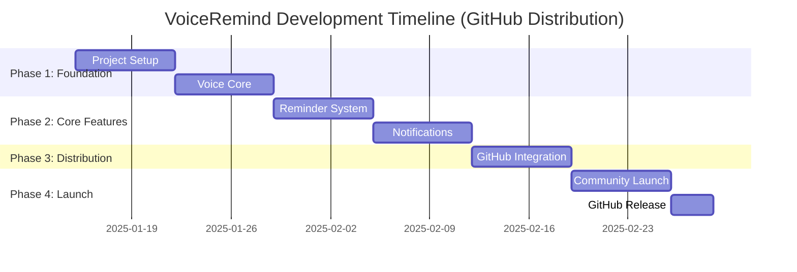

### Detailed Sprint Planning (GitHub Distribution Focus)

#### Sprint 1 (Week 1-2): Foundation + GitHub Setup
**Sprint Goal**: Establish project foundation with GitHub-first distribution

**User Stories**:
- As a developer, I want a well-structured Flutter project integrated with GitHub
- As a user, I want to record my voice for creating reminders hands-free
- As a community member, I want to access the app directly from GitHub

**Tasks**:
- Set up Flutter project with GitHub repository
- Configure GitHub Actions for automated builds
- Implement basic voice recording functionality
- Add text-to-speech capabilities
- Create installation documentation for GitHub distribution

**Definition of Done**:
- User can record voice input
- App can play back text as speech
- GitHub Actions successfully builds APK
- Installation guide published on GitHub Pages

#### Sprint 2 (Week 3-4): Voice Processing + Community Preparation
**Sprint Goal**: Implement intelligent voice-to-reminder conversion and prepare for community launch

**User Stories**:
- As a user, I want my speech converted to accurate text
- As a user, I want natural date/time recognition from my speech
- As a community member, I want clear documentation and easy access

**Tasks**:
- Integrate device native speech-to-text
- Implement natural language processing for scheduling
- Create comprehensive README and documentation
- Set up GitHub Pages website
- Prepare community outreach materials

**Definition of Done**:
- Speech accurately converts to text (>90% accuracy)
- Natural language dates/times parsed correctly
- GitHub Pages site live with full documentation
- Community launch materials ready

#### Sprint 3 (Week 5-6): Reminder Management + GitHub Releases
**Sprint Goal**: Complete reminder functionality and establish release process

**User Stories**:
- As a user, I want to manage all my reminders effectively
- As a community member, I want easy access to stable releases
- As a contributor, I want clear contribution guidelines

**Tasks**:
- Implement complete reminder CRUD functionality
- Set up automated GitHub Releases
- Create contribution guidelines and issue templates
- Implement offline-first data storage
- Add version management and update notifications

**Definition of Done**:
- All reminder operations work correctly
- GitHub Releases automatically generated
- Offline functionality fully operational
- Contribution process documented

#### Sprint 4 (Week 7-8): Notifications + Community Launch
**Sprint Goal**: Implement ADHD-optimized notifications and launch to community

**User Stories**:
- As a user with ADHD, I want persistent notifications that help me remember
- As a community member, I want to provide feedback and report issues
- As an accessibility advocate, I want to share this tool with others

**Tasks**:
- Implement persistent notification system
- Create feedback collection mechanisms
- Launch in ADHD and accessibility communities
- Set up community support channels
- Monitor initial user feedback and usage

**Definition of Done**:
- Notification system works reliably
- Community launch completed successfully
- Support channels active and monitored
- Initial user feedback collected and analyzed

#### Sprint 5 (Week 9-10): Cloud Sync + Web App
**Sprint Goal**: Enable cross-device functionality and web access

**User Stories**:
- As a user, I want my reminders available on all my devices
- As a web user, I want to access VoiceRemind without installing an app
- As a privacy-conscious user, I want control over my data synchronization

**Tasks**:
- Implement Firebase/Supabase cloud synchronization
- Deploy Progressive Web App to GitHub Pages
- Add offline/online sync conflict resolution
- Create data export and privacy controls
- Optimize web app for mobile devices

**Definition of Done**:
- Data syncs reliably across devices
- Web app fully functional and responsive
- Privacy controls implemented
- Cross-platform feature parity achieved

#### Sprint 6 (Week 11-12): Polish + Growth Strategy
**Sprint Goal**: Optimize user experience and plan sustainable growth

**User Stories**:
- As a new user, I want intuitive onboarding and clear value
- As an existing user, I want continuous improvements and new features
- As a supporter, I want ways to contribute to project sustainability

**Tasks**:
- Implement comprehensive onboarding flow
- Add accessibility improvements and testing
- Create sustainability plan (donations, premium features)
- Develop growth strategy and metrics tracking
- Plan future roadmap with community input

**Definition of Done**:
- Onboarding flow completed and tested
- Accessibility standards met
- Sustainability model implemented
- Growth metrics tracking active
- Community roadmap published

### Distribution Timeline

#### GitHub Launch Strategy
```yaml
Week 10: Alpha Release
  - Target: 20 ADHD community testers
  - Platform: GitHub Releases (pre-release)
  - Duration: 1 week intensive testing
  - Feedback: Direct GitHub issues and discussions

Week 11: Beta Release  
  - Target: 100 accessibility community members
  - Platform: GitHub Releases (beta)
  - Duration: 2 weeks broader testing
  - Feedback: Community forums and surveys

Week 12: Public Release
  - Target: General public launch
  - Platform: GitHub Releases (stable) + GitHub Pages
  - Marketing: ADHD communities, accessibility forums, social media
  - Support: GitHub discussions and documentation
```

#### Future Platform Expansion Timeline
```yaml
Month 6: Google Play Evaluation
  - Criteria: 1000+ GitHub downloads, $200+ monthly donations
  - Decision: Data-driven based on user demand and revenue
  - Process: If criteria met, invest $25 for Play Store registration

Month 12: iOS App Store Evaluation  
  - Criteria: 5000+ total users, $500+ monthly revenue
  - Decision: Based on iOS user requests and business case
  - Process: If justified, invest $99 for Apple Developer Program

Month 18: Enterprise/Consulting Services
  - Criteria: Established community and proven impact
  - Focus: Custom accessibility solutions and ADHD workplace programs
  - Revenue: Service-based income to fund continued development
```

---

## Platform & Technology Alternatives Summary

### Backend Technology Alternatives

#### Database Options
1. **Firebase Firestore** (Recommended)
   - **Free Tier**: 50k reads/day, 20k writes/day
   - **Pros**: Real-time sync, offline support, easy scaling
   - **Cons**: Google dependency, potential future costs

2. **Supabase** (Open Source Alternative)
   - **Free Tier**: Unlimited requests, 1GB database
   - **Pros**: Open source, PostgreSQL, self-hostable
   - **Cons**: Newer ecosystem, smaller community

3. **Self-Hosted Solutions** (Maximum Control)
   - **Options**: Railway, Render, Fly.io free tiers
   - **Pros**: Complete control, no vendor lock-in
   - **Cons**: Requires DevOps knowledge, maintenance overhead

#### Voice Processing Alternatives

**Speech-to-Text Options:**
1. **Device Native** (Primary) - Unlimited free, offline capable
2. **OpenAI Whisper API** (Enhanced) - 416 hours/month free
3. **Local Whisper Model** (Advanced) - Completely offline, requires setup
4. **Google Cloud Speech** (Enterprise) - 60 minutes/month free

**Text-to-Speech Options:**
1. **Device Native** (Primary) - Unlimited free, multiple voices
2. **Coqui TTS** (Advanced) - Open source, customizable
3. **Google Cloud TTS** (Premium) - High quality, paid service
4. **OpenAI TTS** (Modern) - AI-generated voices, paid service

### Distribution Platform Alternatives

#### Primary Distribution (Free)
1. **GitHub Releases** (Recommended)
   - **Cost**: $0
   - **Pros**: Direct control, version management, community integration
   - **Cons**: Manual installation, security warnings

2. **F-Droid** (Open Source Store)
   - **Cost**: $0  
   - **Pros**: Open source credibility, automatic updates
   - **Cons**: Limited audience, strict requirements

3. **Progressive Web App** (Universal)
   - **Cost**: $0 (GitHub Pages hosting)
   - **Pros**: No installation required, cross-platform
   - **Cons**: Limited device integration, performance constraints

#### Secondary Distribution (Paid)
1. **Google Play Store**
   - **Cost**: $25 one-time + 30% revenue share
   - **Pros**: Wide reach, automatic updates, discoverability
   - **Cons**: Store policies, review process, fees

2. **Apple App Store**
   - **Cost**: $99/year + 30% revenue share
   - **Pros**: Premium user base, iOS ecosystem
   - **Cons**: High fees, strict review process, annual cost

3. **Alternative App Stores**
   - **Amazon Appstore**: Free registration, alternative Android market
   - **Samsung Galaxy Store**: Device-specific distribution
   - **Microsoft Store**: Windows distribution option

### Revenue Model Alternatives

#### Community-Driven Models
1. **Donation-Based** (Recommended Start)
   - **Platforms**: GitHub Sponsors, Ko-fi, Open Collective
   - **Target**: 5% user contribution rate
   - **Sustainability**: 200+ regular supporters

2. **Open Source Consulting**
   - **Services**: Custom accessibility implementations
   - **Target**: Enterprise and institutional clients
   - **Revenue**: Project-based or retainer agreements

#### Traditional SaaS Models
1. **Freemium** (Future Option)
   - **Free**: Core functionality
   - **Premium**: Advanced features ($2-5/month)
   - **Target**: 10-15% conversion rate

2. **Enterprise Licensing**
   - **Target**: Workplace accessibility programs
   - **Features**: Admin dashboards, compliance reporting
   - **Revenue**: $10-50/user/month for organizations

### Development Team Alternatives

#### Solo Developer Approach (12 weeks)
- **Timeline**: 3-4 months to MVP
- **Cost**: $0 operational costs
- **Benefits**: Complete control, learning experience
- **Challenges**: Longer timeline, single point of failure

#### 4-Developer Team (8 weeks)
- **Timeline**: 2-3 months to MVP
- **Cost**: $15k-25k development + $0 operational
- **Benefits**: Faster delivery, diverse expertise
- **Challenges**: Coordination overhead, higher upfront cost

#### Hybrid Approach (10 weeks)
- **Structure**: Lead developer + 1-2 specialists
- **Timeline**: 2.5 months to MVP
- **Cost**: $8k-15k development + $0 operational  
- **Benefits**: Balanced speed and control
- **Challenges**: Team coordination, scope management

---

## Current Implementation Status

### Feature Implementation Matrix

| Feature | Status | Implementation Details |
|---------|--------|------------------------|
| **AI Text Reminders** | ✅ Complete | Gemini 2.5 Flash & Groq Kimi-K2-Instruct support |
| **Voice Reminders** | ✅ Complete | Groq Whisper API + Device Native STT |
| **Image-Based Reminders** | ✅ Complete | Gemini native image processing |
| **Multi-Time Reminders** | ✅ Complete | Multiple time slots per day with individual tracking |
| **Custom Repeat Patterns** | ✅ Complete | Days of week, intervals, end dates |
| **Standard Repeats** | ✅ Complete | Daily, weekly, monthly |
| **Spaces Organization** | ✅ Complete | Color-coded spaces with icons |
| **Calendar Views** | ✅ Complete | Custom Day/Week/Month views with timeline |
| **Notifications** | ✅ Complete | flutter_local_notifications |
| **Alarm System** | ✅ Complete | awesome_notifications with full-screen |
| **Snooze Functionality** | ✅ Complete | Flexible snooze durations |
| **Boot Reschedule** | ✅ Complete | Automatic reschedule after device reboot |
| **Theme Support** | ✅ Complete | Nothing-inspired light/dark themes |
| **Auto-Update Check** | ✅ Complete | GitHub releases integration |
| **Search & Filter** | ✅ Complete | Search by title, filter by status/space |
| **Local Storage** | ✅ Complete | SharedPreferences (JSON) |
| **Cloud Sync** | ❌ Not Implemented | Local-first architecture |
| **Firebase Integration** | ❌ Not Implemented | No cloud services |
| **Location Reminders** | ❌ Not Implemented | Future feature |
| **Text-to-Speech** | ❌ Not Implemented | Future feature |
| **Wear OS** | ❌ Not Implemented | Future feature |
| **Unit Tests** | ❌ Not Implemented | Testing infrastructure needed |

### App Lifecycle & State Management

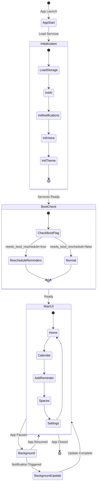

### Service Dependency Graph

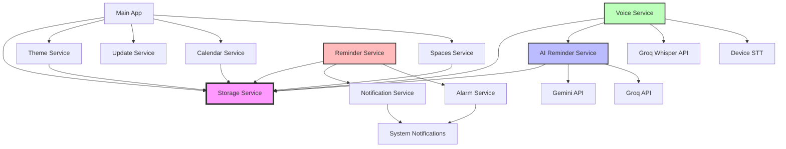

### Key Implementation Highlights

**1. Local-First Architecture**
- All data stored in SharedPreferences
- No cloud dependencies
- Offline-capable for all features
- Boot-persistent reminders

**2. Dual AI Provider Support**
- Gemini: Native audio/image processing, structured JSON output
- Groq: Whisper transcription + LLM parsing
- User can switch providers in settings
- API keys stored locally

**3. Advanced Reminder Features**
- Multi-time reminders with individual slot tracking
- Custom repeat patterns with specific days
- Snooze with flexible durations
- Progress tracking for multi-time reminders

**4. Smart Notification System**
- User choice: Notifications or Alarms
- Boot reschedule mechanism
- Overdue reminder calculation
- Repeating reminder auto-advance

**5. Nothing-Inspired Design**
- Clean, minimal UI
- Smooth animations
- Auto-hiding floating nav bar
- Gesture controls (long-press, double-tap)

---

## Conclusion

This comprehensive documentation reflects the **current implementation** of VoiceRemind as a local-first, AI-powered reminder application with advanced features like multi-time reminders, custom repeat patterns, and dual AI provider support.

### Key Strategic Advantages

1. **Economic Accessibility**: Complete development and deployment possible with $0 operational costs
2. **Platform Independence**: Not dependent on any single platform or vendor
3. **Community-First Approach**: Building directly with and for the ADHD/accessibility community
4. **Progressive Enhancement**: Start free, add premium features based on user demand and revenue
5. **Technology Leadership**: Using cutting-edge voice processing while maintaining accessibility

### Recommended Path Forward

**Phase 1 (Months 1-3)**: GitHub-only distribution with community focus
- Build core functionality using completely free tech stack
- Launch directly to ADHD and accessibility communities
- Establish user base and gather comprehensive feedback
- Prove product-market fit before any financial investment

**Phase 2 (Months 4-9)**: Optimization and sustainability
- Enhance features based on community feedback
- Implement donation-based sustainability model
- Expand community reach and advocacy
- Evaluate app store expansion based on user demand

**Phase 3 (Months 10+)**: Strategic expansion
- Data-driven decision on Google Play Store addition
- Consider iOS development based on user requests
- Explore enterprise and consulting opportunities
- Scale infrastructure only as revenue justifies

### Success Factors

1. **User-Centric Development**: Continuous engagement with ADHD community
2. **Technical Excellence**: Robust offline-first architecture with seamless voice processing
3. **Community Building**: Strong GitHub presence with active community contribution
4. **Sustainable Growth**: Revenue model that supports long-term development without compromising accessibility
5. **Platform Resilience**: Architecture that can adapt to changing platform landscapes

This plan balances ambitious technical goals with pragmatic economic constraints, ensuring VoiceRemind can launch successfully as a community-driven project while building a foundation for potential commercial expansion based on user needs and demonstrated value.